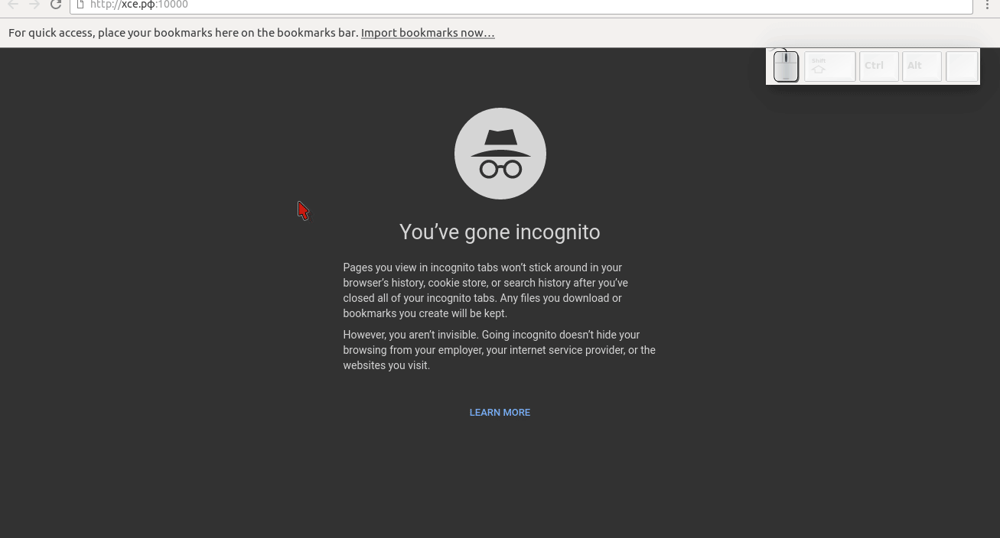
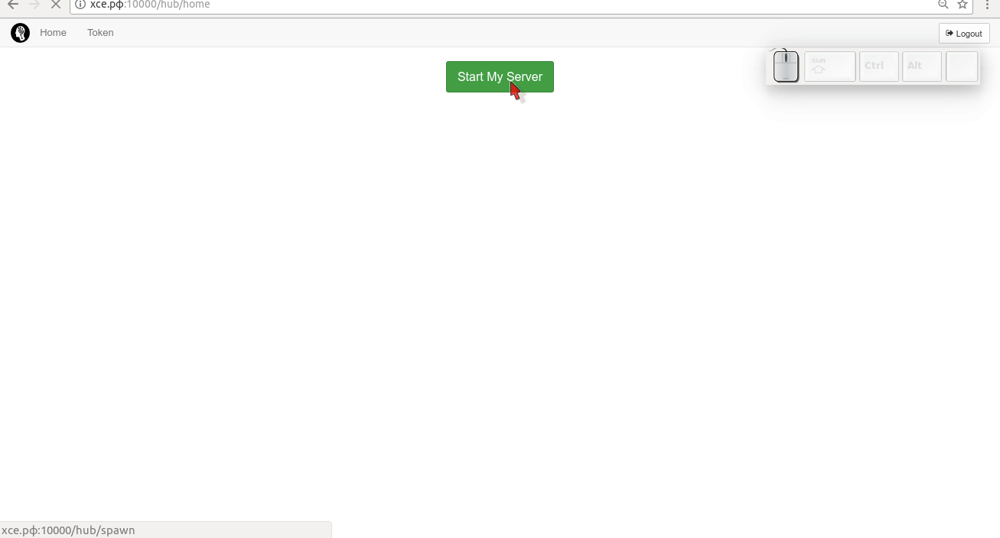
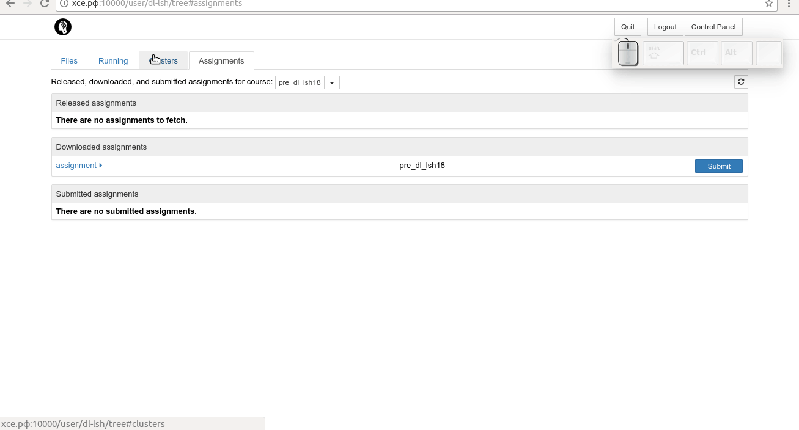

# Введение
Для отборочного задания специально создана отдельная инфраструктура на базе `jupyterhub`. Для каждого студента запускается отдельный изолированный jupyter-сервер. Само задание оформлено в виде набора jupyter-тетрадок с задачами. Выполнять задание нужно внутри вашего сервера. Скачивать тетрадки себе и локально их запускать не нужно. 

## Как начать

### Аутентификация
- перейти на http://хсе.рф:10000
- нажать на `Sign in with Github`
- залогиньтесь под своим github-аккаунтом
- если у вас нет github-аккаунта, то [заведите его](https://github.com) -- это просто и быстро 
- далее пройдите OAuth-аутентификацию, нажав кнопку `Authorize theotheo`
- вы увидите белую страницу с зеленой кнопкой `Start My Server`

### Скачивание задания
- нажмите на кнопку `Start My Server` -- вы увидете практически стандартное окно jupyter-сервера
- перейдите на вкладку `Assignments` 
- нажмите на кнопку `fetch` -- таким образом вы загрузите себе тетрадки с заданиями
- верните на вкладку `Files`
- обновите список файлов и вы увидете директорию `assignments`, в которой и лежат задания

### Выполнение заданий
Hack Hack Hack

### Отправка выполненных заданий

#### отправка через Submit
- перейдите на вкладку `Assignments`
- под полем `Downloaded assignments` кликните на `assignment` -- развернется список тетрадок
- вы можете нажать справа от них кнопки `Validate` -- это может помочь вам увидеть какую-то ошибку. 
> Тетрадки `3_nlp` имеет ошибку с read_only ячейкой, поэтому валидацию не проходит. Так же стоит отметить, что проверки весьма поверхностны, и не гарантируют корректности решения. Как и наоборот: проваленная проверка не говорит, что решение неверно. 
- для непосредственной отправки выполненного задания нажмите на синию кнопку `Submit` -- под полем `Submitted assignments` появится новая строчка

#### отправка на почту
Помимо этого желательно, чтобы вы отправили архив с папкой assignment на почту мастерской. Проще всего это сделать следующим образом:
- создать в корне новую тетрадку
- выполнить там команду `! tar -zcvf dl-lsh.tar.gz assignment/`
- скачать к себе на компьютер получившийся архив
- отправить его на почту deeplearning@letnyayashkola.org

### Ожидание результатов
Пожалуйста, ожидайте
